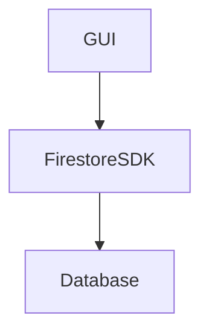
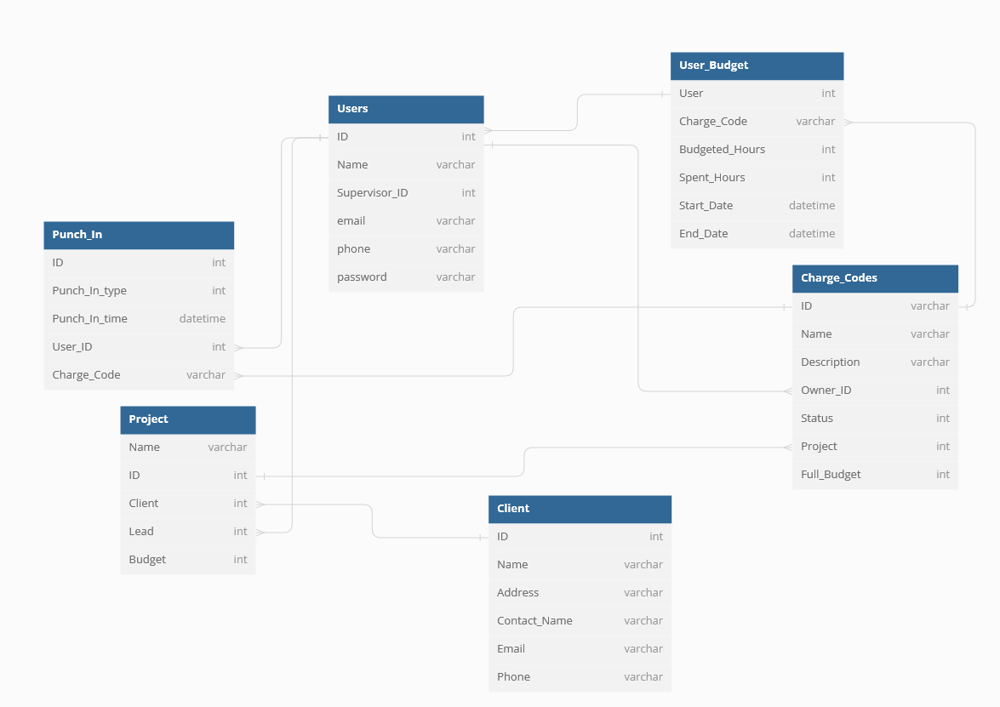
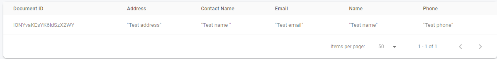
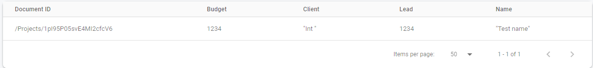
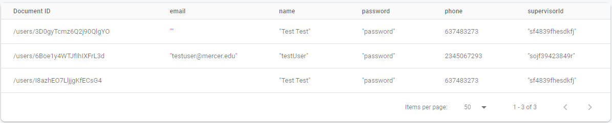
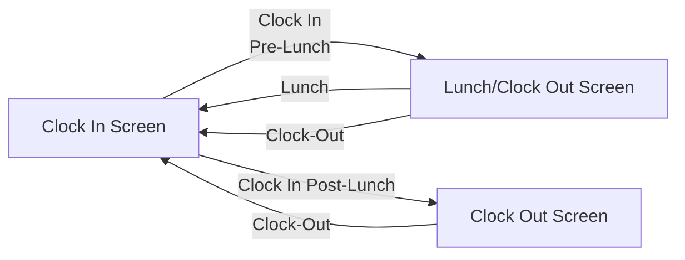

# timekeeper

TimeKeeper is a project from %%TODO: Add Names Alpha order %% for a Database Design course at Mercer University.
This project was designed 

# Overview
When it comes to time tracking for Work there are very few options that lower level employees have access to. This is why we elected to design a time keeping application that will allow a employee to punch in and out during the work day and track how many hours they have left on a charge code. We call this project **TimeKeeper**.

# Design
* How to build a UI in Flutter
* How to connect to Firebase
* How to pull and display data from Firebase.

The Framework for this database is rather simple.

The Complex part is how our database connects. Below you can see a connected database graph or our whole database.

This database has been filled with temporary data for engineering purposes. Below is our sample data on the Firestore Database.

We currently have one sample client:

One sample Project:

Two sample Charge Codes:

One sample user budget:
![User Budgets]](./assets/documentation/User Budgets.png)

And three sample users:

# Prototype
For our UI we have working versions of several of our UI Elements planned. Below is an example of our Projects view which we filled with dummy data. This same view is going to be used in the Charge Codes and Stats View. These are primary used to show the user status of a project or the charge codes they have available.

To connect to the database one must first login so we can provide all information they are allowed to see.

After entering their information the database checks if they are really users and logs them in.

If the yare the console does print out some information for develop usage.

If not they will similarly be informed.

Finally after login they will land on our pinch in Home page. In future development we will post to the database their clock-in and clock-out times.

This screen is the primary piece of TimeKeeper, easy trackable method to clock-in. From here the Home tab allows the user to select Lunch or Clock Out. If the user Clocks out it will post their times and return to the Clock In view. If the user selects Lunch it will let them clock back in and then clock out.

To try out our flutter project may take some step please refer to the included codebase.