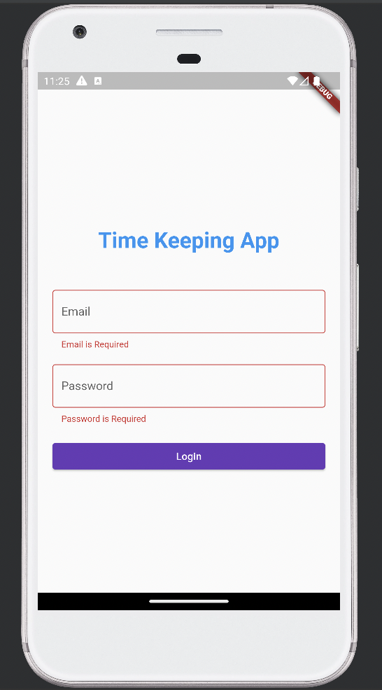
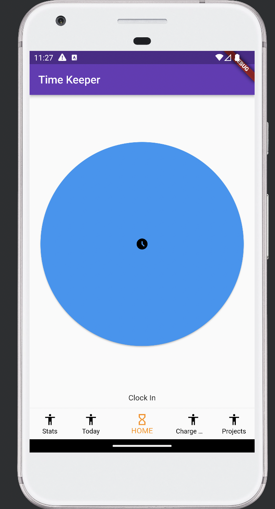

# TimeKeeper

**TimeKeeper** is a project from Dylan DeVries, Mohammad Zaidi, and Paul Pace for a Database Design course at Mercer University.
This project was designed to help  track hours worked for various projects currently focusing on capturing punch-in times such as clocking in, leaving for lunch, returning from lunch, and clocking out. The project also allows the user to view data points from the database in relationship to projects, and charge codes.
The Current state of the project is rather rudimentary focusing on the database design and retrieving data from it, but could easily be expanded to a enterprise grade project, task and time keeping system. This project should be considered more of a proof of concept design rather than a final implementation.

# Overview
**Timekeeper** is a flutter application designed to work dynamically for each companies specific use case with little modification. This requires a simplistic design with modifiable styles, and page toggling. To start we have designed a minimum viable product that will allow employees to enter their punch-in times and track how many hours they have worked in a day. Additionally we have added views for charge codes, and projects for each user so that users can see the current budget for these items. Future development would include the ability to add user permissions for projects and charged codes allowing them to add, view or edit these fields and the ability for the company to establish which views they would like to use. 

# Design

The design of our Flutter app is fairly typical. We are using the Firestore database service from Firebase and are using a simplistic Model View for all of our data.

## Framework
The Framework for this database is rather simple.

This is the common structure for any application using Firebase. The GUI connects the Firestore SDK and that communicates with the database. This makes the database connection simple if configured properly. Future development may move away from Firestore to a self-host alternative allowing for companies to own their own data.
## Database Architecture
The Complex part is how our database connects internally. Below you can see a connected database graph or our whole database.

If you would like to know about the different fields please the [Database Dictionary](#database-dictionary).

### Sample Data

This database has been filled with temporary data for engineering purposes. Below is our sample data on the Firestore Database.

We currently have one sample client:

One sample Project:

Two sample Charge Codes:

One sample user budget:

And three sample users:

## Prototype
For our UI we have working versions of several of our UI Elements planned. Below is an example of our Projects view which we filled with dummy data. This same view is going to be used in the Charge Codes and Stats View. These are primary used to show the user status of a project or the charge codes they have available.

To connect to the database one must first login so we can provide all information they are allowed to see.

After entering their information the database checks if they are really users and logs them in.

If the yare the console does print out some information for develop usage.

If not they will similarly be informed.

Finally after login they will land on our pinch in Home page. In future development we will post to the database their clock-in and clock-out times.

This screen is the primary piece of TimeKeeper, easy trackable method to clock-in. From here the Home tab allows the user to select Lunch or Clock Out. If the user Clocks out it will post their times and return to the Clock In view. If the user selects Lunch it will let them clock back in and then clock out.

To try out our flutter project may take some step please refer to the included codebase.

# Appendix

## Database Dictionary